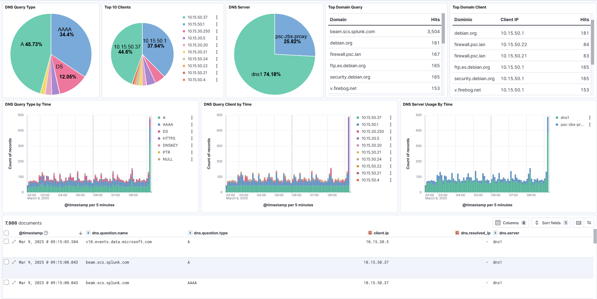

# Adguard Home ELK Integration

This integration is made using Elastic-Agent, so install Elastic Agent on the same server where adguardhome is running.

The fields are converted to ECS.

|Log field||Elastic field|
|-|-|-|
|adguard.QH|->|dns.question.name|
|adguard.QT|->|dns.question.type|
|adguard.QC|->|dns.question.class|
|adguard.IP|->|client.ip|
|adguard.Elapsed|->|event.duration|
|adguard.Result.IPList|->|dns.resolved_ip|

## Dashboard example

This is an example Dashboard



## Ingest Pipeline

Go to Stack Management -> Ingest Pipelines and create a new Ingest Pipeline.

Add this processors and save the pipeline with name **adguard_json_pipeline**

```
[
  {
    "json": {
      "field": "message",
      "target_field": "adguard"
    }
  },
  {
    "rename": {
      "field": "adguard.QH",
      "target_field": "dns.question.name"
    }
  },
  {
    "rename": {
      "field": "adguard.QT",
      "target_field": "dns.question.type"
    }
  },
  {
    "rename": {
      "field": "adguard.QC",
      "target_field": "dns.question.class"
    }
  },
  {
    "rename": {
      "field": "adguard.IP",
      "target_field": "client.ip"
    }
  },
  {
    "rename": {
      "field": "adguard.Elapsed",
      "target_field": "event.duration"
    }
  },
  {
    "rename": {
      "field": "adguard.Result.IPList",
      "target_field": "dns.resolved_ip",
      "ignore_missing": true
    }
  },
  {
    "script": {
      "source": "if (ctx.adguard?.Elapsed != null) {\r     ctx.event = ctx.event == null ? [:] : ctx.event;\r     ctx.event.duration = ctx.adguard.Elapsed * 1000;\r }",
      "description": "Elapsed rename to Duration and multiply x 1000"
    }
  },
  {
    "script": {
      "source": "if (ctx.adguard?.T != null) {\r     try {\r         // Convertir la fecha a Instant usando Painless (en formato ISO 8601)\r         String timestamp = ctx.adguard.T;\r         def instant = ZonedDateTime.parse(timestamp).toInstant();\r         ctx[\"@timestamp\"] = instant.toString();\r     } catch (Exception e) {\r         ctx[\"@timestamp\"] = ctx.adguard.T; // En caso de error, mantener el valor original\r     }\r }\r ",
      "description": "Set log time as event timestamp"
    }
  },
  {
    "script": {
      "source": "if (ctx.Result?.IPList != null) { \r     ctx.dns = ctx.dns == null ? [:] : ctx.dns;\r     ctx.dns.resolved_ip = ctx.Result.IPList;\r }\r ",
      "description": "DestinationIP rename"
    }
  },
  {
    "remove": {
      "field": [
        "message",
        "adguard"
      ]
    }
  }
]
```

## Custom logs

Create a Custom Logs integration on Fleet inside Elastic Agent installed on node with Adguard.

- **Name:** adguardhome
- **Log file path:** Path for workdir/data/query.json (for example: `/docker/adguard/workdir/data/querylog.json`)
- **Dataset name:** adguard
- **Processors:** Set the code below
```
pipeline: "adguard_json_pipeline"
```

Save integration

