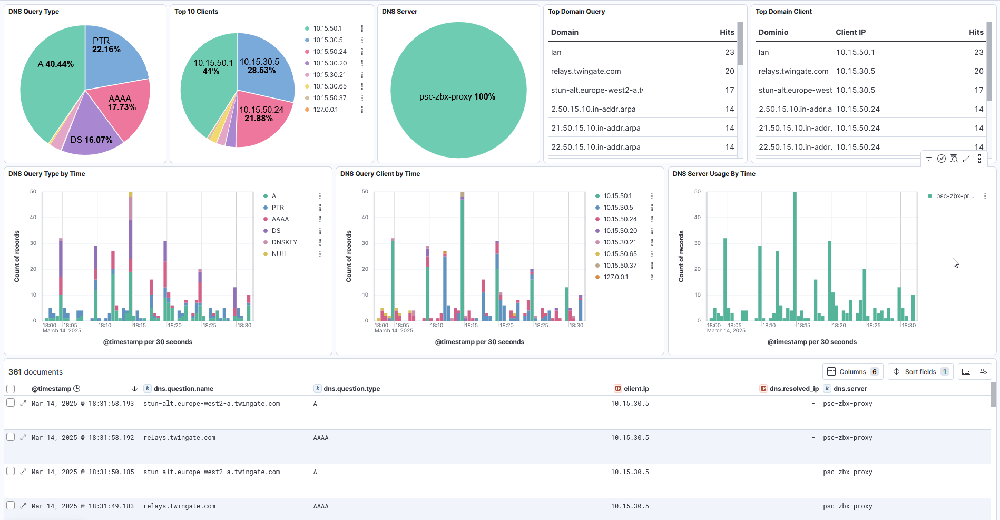

# PiHole v6 ELK Integration

This integration is made using Elastic-Agent, so install Elastic Agent on the same server where PiHole is running.

The fields are converted to ECS.

## Dashboard

This is an example Dashboard



## Ingest Pipeline

Go to Stack Management -> Ingest Pipelines and create a new Ingest Pipeline.


## Pipeline logs-pihole.log

Create a Ingest Pipeline with name 

```
logs-pihole.log
```

Add this processor steps

```
[
  {
    "grok": {
      "field": "message",
      "patterns": [
        "^%{MONTH:month} %{SPACE}%{NUMBER:day} %{TIME:time} dnsmasq\\[[0-9]+\\]: %{WORD:dns.type}"
      ],
      "description": "Get header and dns event_action"
    }
  },
  {
    "pipeline": {
      "name": "logs-pihole.log-1.0.0-query",
      "ignore_missing_pipeline": true,
      "if": "ctx.dns.type == 'query'"
    }
  },
  {
    "pipeline": {
      "name": "logs-pihole.log-1.0.0-cached",
      "ignore_missing_pipeline": true,
      "if": "ctx.dns.type == 'cached'"
    }
  },
  {
    "pipeline": {
      "name": "logs-pihole.log-1.0.0-forwarded",
      "ignore_missing_pipeline": true,
      "if": "ctx.dns.type == 'forwarded'"
    }
  },
  {
    "pipeline": {
      "name": "logs-pihole.log-1.0.0-reply",
      "ignore_missing_pipeline": true,
      "if": "ctx.dns.type == 'reply'"
    }
  },
  {
    "pipeline": {
      "name": "logs-pihole.log-1.0.0-config",
      "ignore_missing_pipeline": true,
      "if": "ctx.dns.type == 'config'"
    }
  }
]
```

### Subpipeline logs-pihole.log-1.0.0-query

Create another Ingest Pipeline with name to manage the query type log.

```
logs-pihole.log-1.0.0-query
```

Processors

```
[
  {
    "grok": {
      "field": "message",
      "patterns": [
        "^%{MONTH:month}%{SPACE}%{NUMBER:day} %{TIME:time} %{WORD:process.name}\\[%{NUMBER:process.pid}\\]: query\\[%{WORD:dns.question.type}\\] %{GREEDYDATA:dns.question.name} from %{IP:client.ip}"
      ]
    }
  },
  {
    "set": {
      "field": "event.action",
      "value": "dns_query"
    }
  }
]
```
### Subpipeline logs-pihole.log-1.0.0-cached

Create another Ingest Pipeline with name to manage the cached type log. 

```
logs-pihole.log-1.0.0-cached
```

Processors

```
[
  {
    "grok": {
      "field": "message",
      "patterns": [
        "^%{MONTH:month} %{SPACE}%{NUMBER:day} %{TIME:time} dnsmasq\\[%{NUMBER:process.pid}\\]: cached(?:-stale)? %{GREEDYDATA:dns.question.name} is %{GREEDYDATA:dns.answers.data}"
      ]
    }
  },
  {
    "set": {
      "field": "event.action",
      "value": "cached"
    }
  }
]
```


### Subpipeline logs-pihole.log-1.0.0-config

Create another Ingest Pipeline with name to manage the config type log. This log is a kind of response with NXDOMAIN

```
logs-pihole.log-1.0.0-config
```

Processors

```
[
  {
    "grok": {
      "field": "message",
      "patterns": [
        "^%{MONTH:month} %{SPACE}%{NUMBER:day} %{TIME:time} dnsmasq\\[%{NUMBER:process.pid}\\]: config %{GREEDYDATA:dns.question.name} is %{WORD:pihole.config.response}"
      ]
    }
  },
  {
    "set": {
      "field": "event.action",
      "value": "dns_reply"
    }
  },
  {
    "set": {
      "field": "dns.type",
      "value": "reply"
    }
  }
]
```

### Subpipeline logs-pihole.log-1.0.0-forwarded

Create another Ingest Pipeline with name to manage the forwarded type log. 

```
logs-pihole.log-1.0.0-forwarded
```

Processors

```
[
  {
    "grok": {
      "field": "message",
      "patterns": [
        "^%{MONTH:month} %{SPACE}%{NUMBER:day} %{TIME:time} dnsmasq\\[%{NUMBER:process.pid}\\]: forwarded %{GREEDYDATA:dns.question.name} to %{IP:dns.resolver.ip}"
      ]
    }
  },
  {
    "set": {
      "field": "event.action",
      "value": "dns_forwarded"
    }
  }
]
```

### Subpipeline logs-pihole.log-1.0.0-reply

Create another Ingest Pipeline with name to manage the forwarded type log. 

```
logs-pihole.log-1.0.0-reply
```

Processors

```
[
  {
    "grok": {
      "field": "message",
      "patterns": [
        "^%{MONTH:month} %{SPACE}%{NUMBER:day} %{TIME:time} dnsmasq\\[%{NUMBER:process.pid}\\]: reply %{GREEDYDATA:dns.question.name} is %{IP:dns.answers.data}"
      ]
    }
  },
  {
    "set": {
      "field": "event.action",
      "value": "dns_reply"
    }
  }
]
```

## Custom logs

Create a Custom Logs integration on Fleet inside Elastic Agent installed on node with Adguard.

- **Name:** DNS Pihole
- **Log file path:** Path for pihole.log (for example: `/docker/pihole/var-log-pihole/pihole.log`)
- **Dataset name:** pihole
- **Processors:** Set the code below
```
pipeline: "logs-pihole.log"
```

Save integration

## Docker PiHole

On docker compose for PiHole container add the line 

```
- './var-log-pihole:/var/log/pihole'
```

under volumes section, to ensure that ELK Agent can read the file. Example

```
volumes:
  - './etc-pihole:/etc/pihole'
  - './etc-dnsmasq.d:/etc/dnsmasq.d'
  - './var-log-pihole:/var/log/pihole'
```